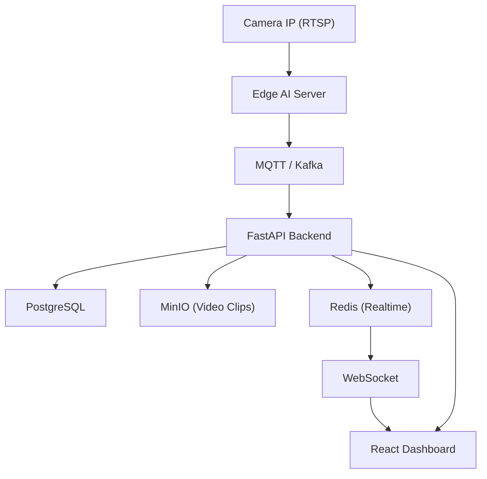

# Factory Guard AI – Implementation Plan

Xây dựng hệ thống giám sát nhà máy bằng AI camera: phát hiện vi phạm an toàn lao động (không đội mũ, vào vùng cấm…), cảnh báo realtime, lưu clip bằng chứng và dashboard quản lý. Kiến trúc edge-first – AI chạy tại nhà máy, không phụ thuộc internet.

---

## Kiến trúc tổng thể



---

## Giai đoạn 1 – Nền tảng & PPE Detection (1–2 tháng)

### AI / Edge Module (`edge/`)

#### [NEW] `edge/capture.py`
- Đọc RTSP stream từ camera IP bằng **OpenCV**
- Decode frame, resize, đưa vào inference pipeline

#### [NEW] `edge/detector.py`
- Load **YOLOv8** model (custom-trained hoặc pre-trained)
- Detect các class: `person`, `helmet`, `no-helmet`, `vest`, `no-vest`, `glove`, `no-glove`
- Trả về bounding boxes + confidence scores

#### [NEW] `edge/event_publisher.py`
- Khi phát hiện vi phạm → publish event lên **MQTT** (topic: `factory/events`)
- Payload: `{ camera_id, timestamp, violation_type, confidence, frame_snapshot }`

#### [NEW] `edge/config.yaml`
- Cấu hình camera URLs, model path, MQTT broker, thresholds

---

### Backend (`backend/`)

#### [NEW] `backend/main.py`
- **FastAPI** app entrypoint
- Mount routers: `/events`, `/cameras`, `/violations`, `/clips`, `/ws`

#### [NEW] `backend/routers/events.py`
- `POST /events` – nhận event từ Edge, lưu vào PostgreSQL
- `GET /events` – lấy danh sách vi phạm (filter theo camera, ngày, loại)

#### [NEW] `backend/routers/clips.py`
- `GET /clips/{event_id}` – presigned URL để download clip từ **MinIO**

#### [NEW] `backend/routers/websocket.py`
- WebSocket endpoint `/ws/alerts`
- Khi có event mới → push realtime lên tất cả clients đang kết nối

#### [NEW] `backend/services/clip_saver.py`
- Subscribe MQTT, nhận event → buffer 10s trước + sau
- Upload clip `.mp4` lên **MinIO**

#### [NEW] `backend/db/models.py`
- SQLAlchemy models: `Camera`, `ViolationEvent`, `VideoClip`

#### [NEW] `backend/db/migrations/`
- Alembic migration scripts

#### [NEW] `backend/config.py`
- Settings từ `.env`: DB URL, MinIO, Redis, MQTT

---

### Frontend (`frontend/`)

#### [NEW] `frontend/src/pages/Dashboard.tsx`
- Grid hiển thị live feed thumbnail từng camera
- Badge cảnh báo realtime (kết nối qua WebSocket)

#### [NEW] `frontend/src/pages/Violations.tsx`
- Bảng danh sách vi phạm: camera, thời gian, loại vi phạm, confidence
- Nút xem / tải clip

#### [NEW] `frontend/src/components/AlertBanner.tsx`
- Toast notification khi có vi phạm mới qua WebSocket

#### [NEW] `frontend/src/components/CameraCard.tsx`
- Hiển thị thumbnail + tên camera + trạng thái online/offline

---

### Infrastructure

#### [NEW] `docker-compose.yml`
- Services: `postgres`, `redis`, `minio`, `mosquitto` (MQTT), `backend`, `frontend`

#### [NEW] `.env.example`
- Template biến môi trường

---

## Giai đoạn 2 – Tracking & Realtime Alert (tháng 2–3)

### AI / Edge Module

#### [MODIFY] `edge/detector.py`
- Tích hợp **ByteTrack** để tracking người xuyên suốt frame
- Gán `worker_id` tạm thời (track ID) cho mỗi người

#### [NEW] `edge/zone_guard.py`
- Định nghĩa vùng cấm bằng polygon (config từ YAML)
- Kiểm tra nếu `worker_id` đi vào vùng cấm → trigger event

### Backend

#### [MODIFY] `backend/routers/events.py`
- Thêm field `worker_track_id` vào event schema

#### [NEW] `backend/routers/cameras.py`
- CRUD camera: tên, RTSP URL, tọa độ vùng cấm

### Frontend

#### [NEW] `frontend/src/pages/CameraConfig.tsx`
- UI vẽ polygon vùng cấm lên ảnh thumbnail camera (canvas)

#### [NEW] `frontend/src/pages/WorkerTrace.tsx`
- Timeline hành vi của 1 worker theo track ID trong ca làm việc

---

## Giai đoạn 3 – Action Recognition & Analytics (tháng 3–4)

### AI / Edge Module

#### [NEW] `edge/action_recognizer.py`
- Dùng **SlowFast** hoặc **LSTM+CNN** để nhận diện:
  `fall`, `fight`, `idle_too_long`, `crowd_gathering`
- Input: chuỗi frame của 1 track ID

#### [NEW] `edge/productivity_tracker.py`
- Tính `idle_time`, `active_time`, `cycle_time` theo track ID + ca

### Backend

#### [NEW] `backend/routers/analytics.py`
- `GET /analytics/shift` – thống kê vi phạm theo ca
- `GET /analytics/productivity` – năng suất theo camera / khu vực

#### [NEW] `backend/services/report_generator.py`
- Dùng **LLM (OpenAI hoặc Ollama local)** để tự động viết báo cáo vi phạm bằng ngôn ngữ tự nhiên

### Frontend

#### [NEW] `frontend/src/pages/Analytics.tsx`
- Biểu đồ vi phạm theo ngày / ca (Recharts)
- Heatmap khu vực nguy hiểm
- Bảng năng suất

#### [NEW] `frontend/src/pages/Reports.tsx`
- Hiển thị báo cáo LLM-generated, cho phép export PDF

---

## Stack đề xuất

| Thành phần | Công nghệ |
|---|---|
| AI Detection | Python + YOLOv8 (Ultralytics) |
| Video Input | OpenCV + GStreamer |
| Tracking | ByteTrack |
| Action Recognition | SlowFast / LSTM+CNN |
| Message Queue | MQTT (Mosquitto) |
| Backend | FastAPI + SQLAlchemy |
| Database | PostgreSQL |
| Realtime | Redis + WebSocket |
| Video Storage | MinIO |
| Frontend | React + Ant Design + Recharts |
| Container | Docker + Docker Compose |

---

## Cấu trúc thư mục đề xuất

```
factory-guard-ai/
├── edge/                  # AI inference chạy tại nhà máy
│   ├── capture.py
│   ├── detector.py
│   ├── tracker.py
│   ├── zone_guard.py
│   ├── action_recognizer.py
│   ├── event_publisher.py
│   └── config.yaml
├── backend/               # FastAPI server
│   ├── main.py
│   ├── config.py
│   ├── routers/
│   ├── services/
│   └── db/
├── frontend/              # React dashboard
│   ├── src/
│   │   ├── pages/
│   │   └── components/
│   └── package.json
├── docker-compose.yml
└── .env.example
```

---

## Verification Plan

### Phase 1

| Test | Cách chạy |
|---|---|
| Unit test YOLO detector | `cd edge && python -m pytest tests/test_detector.py` |
| Unit test event publisher | `cd edge && python -m pytest tests/test_publisher.py` |
| API test – POST /events | `cd backend && pytest tests/test_events_api.py` |
| API test – WebSocket | `cd backend && pytest tests/test_websocket.py` |

### Manual Verification

1. **Chạy toàn bộ stack**: `docker-compose up`
2. **Giả lập camera**: dùng `ffmpeg` stream video file như RTSP: 
   `ffmpeg -re -stream_loop -1 -i test_video.mp4 -f rtsp rtsp://localhost:8554/test`
3. **Chạy edge module**: `python edge/capture.py --camera rtsp://localhost:8554/test`
4. **Kiểm tra dashboard** tại `http://localhost:3000`:
   - Xem cửa sổ camera hiển thị
   - Khi phát hiện người không đội mũ → toast alert xuất hiện trong 5 giây
   - Vi phạm được liệt kê trong tab "Vi phạm"
   - Clip 10s có thể download được

> [!IMPORTANT]
> Cần chuẩn bị video test (`test_video.mp4`) có cảnh người không đội mũ bảo hộ để chạy manual test đầu cuối.

> [!WARNING]
> Face Recognition (InsightFace/ArcFace) **không** nằm trong scope ban đầu vì lý do pháp lý. Chỉ thêm khi có văn bản đồng ý từ đơn vị triển khai.
